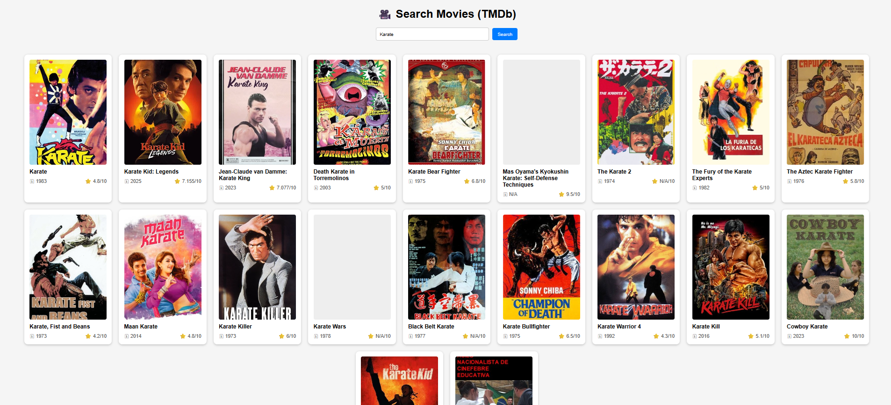
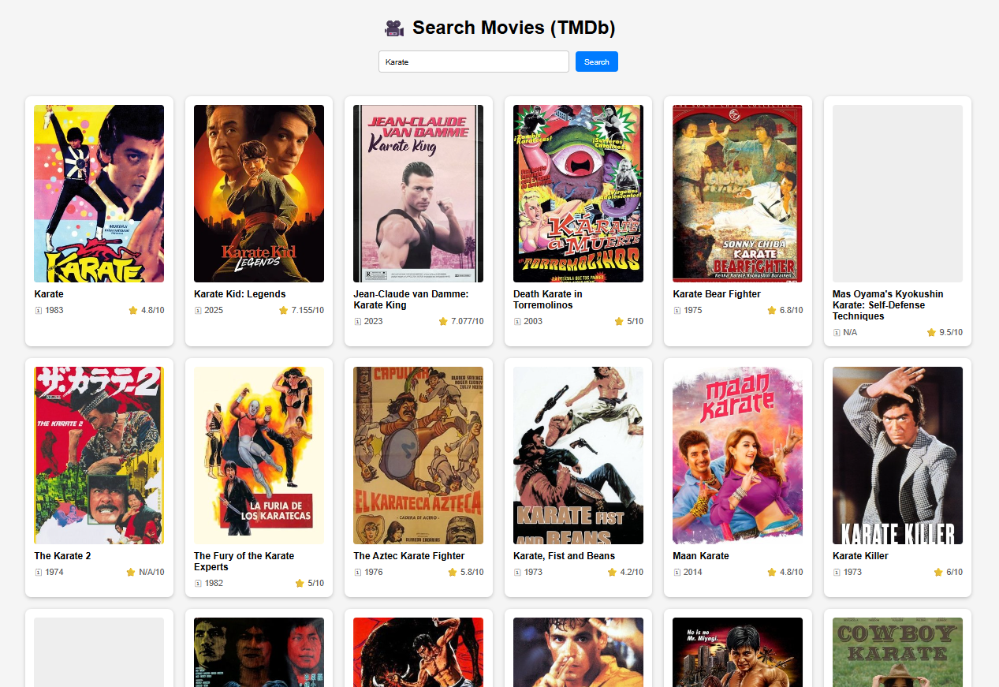

#  🎥 Movie Search App
A sleek and responsive movie search application built with HTML, CSS, and JavaScript. It lets users effortlessly search for movie details, including posters, titles, release dates, and ratings.


## 🌐 Live Demo
You can try the app here:
[Search for Movie](https://rytvee.github.io/movie-search-app/)


## ✨ Features
- 🔍 **Live search** — fetches and displays real-time results as you type  
- 🎞️ **Movie details** — view posters, titles, ratings, release dates (depending on API data)  
- 📱 **Responsive design** — works well on both desktop and mobile  
- 🎨 **Clean UI** — intuitive interface with modern styling

## 🛠 Technologies Used
- HTML5 – Structure of the app
- CSS3 – Styling and responsive layout
- JavaScript (Vanilla JS) – Core logic and API handling
- TMDb API – Movie data
- Vercel Serverless Functions — to hide the API key from the frontend
- Vercel Environment Variables — secure API key storage

## 📂 Project Structure
```text
weatherapp/
│── index.html             # Main HTML layout
│── style.css              # CSS for styling
│── script.js              # JavaScript logic (API calls, UI interaction)
│── README.md              # Documentation
│
├── weather-api-proxy/     # Secure backend layer (Vercel serverless functions)
│ └── api/                 # API endpoint folder
│   └── search.js          # Movie search API endpoint
│
└── images/                # Icon and images
```

## 🔐 API handling
The 📂 `movie-search-api/` `api/` folder contains the serverless API endpoint used when the app is deployed to Vercel.
Acts as a proxy between the browser and the external movie API.
The API key is stored securely in Vercel Environment Variables (or .env for local development).
Prevents the API key from being exposed in client-side code.

## 📋 How It Works
**Browser (GitHub Pages frontend)**  
&nbsp;&nbsp;&nbsp;&nbsp;&nbsp;&nbsp;↓ request to `/api/weather`  
**Vercel Serverless Function** (`weather-api-proxy/`)  
&nbsp;&nbsp;&nbsp;&nbsp;&nbsp;&nbsp;↓ attaches API key from environment  
**External Movie API**  
&nbsp;&nbsp;&nbsp;&nbsp;&nbsp;&nbsp;↑ returns data to Vercel  
**Vercel → Browser**  


## 🚀 Usage
1. Enter a movie name in the search box.
2. Click "Search".
3. View search result.

## 📷 Screenshot

**Desktop view**




**Tablet view**




**Mobile view**


## 📜 License
This project is free to use and modify.

